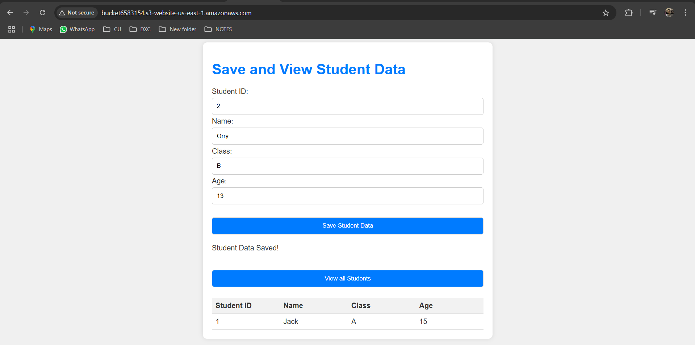
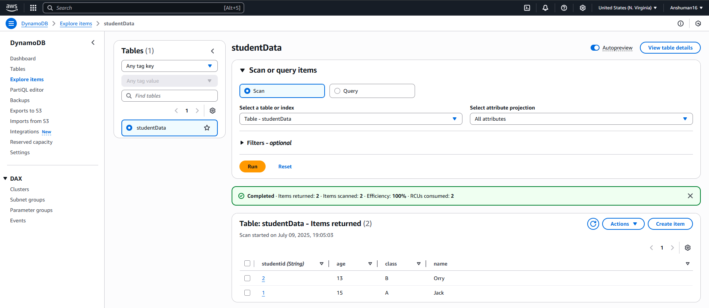
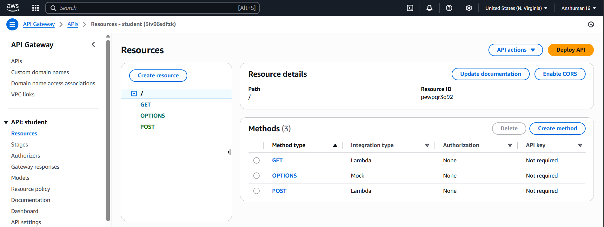
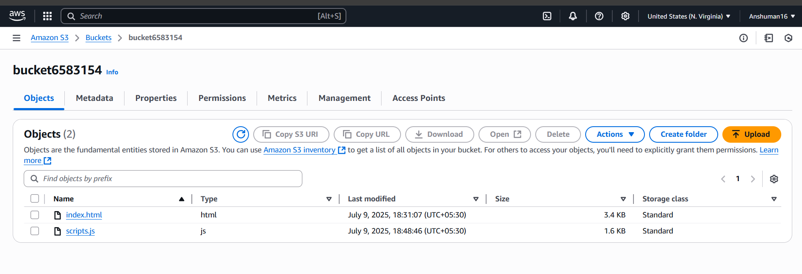

# AWS-SERVERLESS-DEPLOYMENT

🧩 Project Overview:

 Implemented and deployed a fully serverless infrastructure on AWS to host and run a student data management system that helps to store and list student data with dynamic frontend-backend interaction.
🔹 Frontend: Static website (HTML + JavaScript) hosted on Amazon S3
🔹 Backend Services:
 1. API Gateway to expose secure REST endpoints.
 2. AWS Lambda functions to handle GET and POST logic.
 3. DynamoDB to store and retrieve student data.

🔧 Technologies Used

 Service            | Purpose                                  
--------------------|------------------------------------------
 Amazon S3          | Hosts the static frontend website        
 Amazon API Gateway | Exposes REST APIs securely               
 AWS Lambda         | Runs backend logic for GET/POST requests 
 Amazon DynamoDB    | Stores student records                   
 IAM Roles          | Controls secure access between services  

 📸 Project Screenshots & Components Overview
 

 ## 💻 Web UI 
 

##  🧱 Amazon DynamoDB 

##  📡 Amazon API Gateway – REST API Configuration

##  📂 Amazon S3 -

✅ Outcome:

 🔹Successfully deployed a real-world application on AWS using only managed services
 🔹Configured IAM roles, API Gateway resources, and CORS settings
 🔹Ensured smooth communication between frontend and backend components in a secure and scalable manner.

🚀 What I Achieved:

🔹Strengthened my understanding of cloud-native deployments and serverless workflows.
🔹Improved my practical skills in using AWS core services in a real deployment scenario.
🔹Built confidence to handle real-world cloud projects from an infrastructure and DevOps perspective.

📌 Always excited to learn, build, and optimize cloud solutions.
 Open for Cloud and Devops engineer role 🙌

Feel free to connect with me:

Anshuman Goswami
- 📧 [Email](mailto:anshumangoswami03@gmail.com)
- 🌐 [LinkedIn](https://www.linkedin.com/in/anshuman-goswami-devopsenthusiast/)

